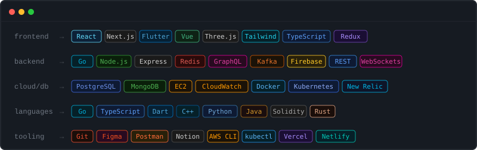

<div align="center">


<br/>

<sub><code>new delhi &nbsp;·&nbsp; omniful ai &nbsp;·&nbsp; building things that matter</code></sub>

<br/><br/>

[](https://discord.com/users/753159553649999914)
[](https://www.instagram.com/ayusssshhhhhh_/)
[](https://x.com/Ayuuuu_25)
[](https://medium.com/@ranaayush0730)
[](https://www.youtube.com/@TheComicConnection)
[](https://www.linkedin.com/in/ayush-ranjan019/)
[](https://ayuuu-pro.vercel.app/)

</div>

---

<div align="center">
  
</div>

---

```python
class Ayush:
    location     = "New Delhi, India"
    current_role = "SDE @ Omniful AI"
    building     = ["high-throughput systems in Go", "distributed event pipelines", "AI-native tooling"]
    learning     = ["Rust", "eBPF", "consensus algorithms"]
    philosophy   = "if it's not fast, it's not done"
    interests    = ["system design", "compilers", "low-level networking", "comic books", "gaming", "cooking"]
    ask_me_about = ["Go internals", "event-driven architecture", "why Dart is underrated"]

    def available_for(self):
        return ["collabs", "open source", "side projects", "coffee chats"]
```

---

```
// currently shipping

▶  qcache          — in-memory KV store, custom eviction, Redis RESP protocol    [ Go           ]  ████████░░  80%
▶  event_arcade    — distributed arcade engine, Kafka-backed event bus           [ TypeScript   ]  █████░░░░░  55%
▶  prepio          — interview prep platform, Go microservices + Flutter         [ Next/Flutter ]  ███░░░░░░░  30%

// on the radar

○  Rust            — ownership model, zero-cost abstractions, WASM target
○  eBPF            — kernel-level observability without instrumentation overhead
○  WebAssembly     — portable, sandboxed, near-native execution in the browser
```

<div align="center">
<sub>always down to collab &nbsp;·&nbsp; <a href="mailto:ranaayush0725@gmail.com">ranaayush0725@gmail.com</a></sub>
</div>
